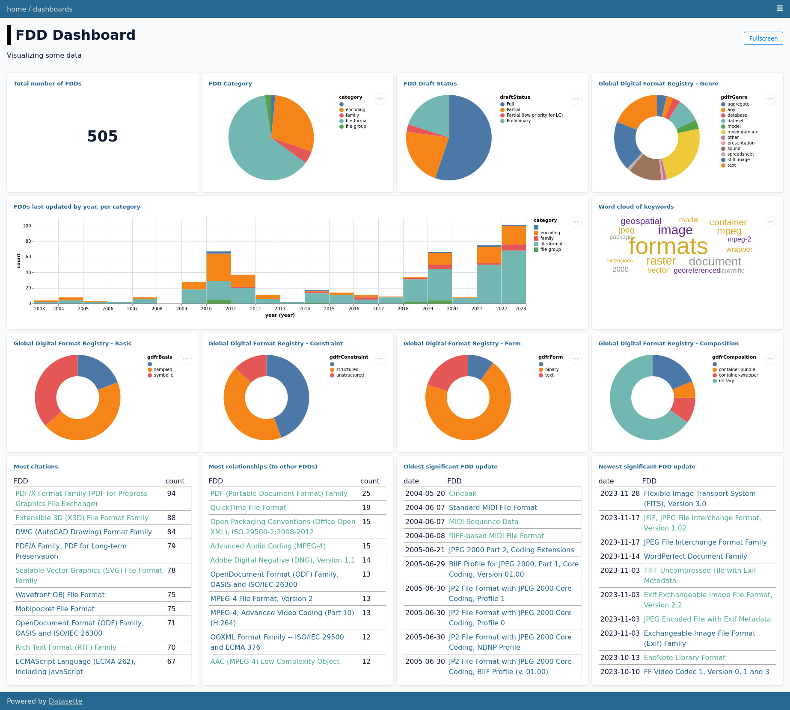

# lc-sdf-data-exploration

See the results live: [https://lc-sdf-data-exploration.vercel.app/](https://lc-sdf-data-exploration.vercel.app/)  

Read a blog post about it: [Library of Congress Format Descriptions Visualization](https://bits.ashleyblewer.com/blog/2023/12/04/library-of-congress-format-description-visualization/)

## Contents

- fdd_database.db
A checked-in [sqlite database](https://www.sqlite.org/index.html) created from `xml_to_sqlite.py`

- metadata.yml
A [YAML file](https://yaml.org/) configured for [Datasette](https://datasette.io/) with the [datasette-dashboards](https://github.com/rclement/datasette-dashboards) plug-in. Optional, add data-render-binary to see a few fields. Install `pip install datasette-render-binary`

- xml_to_sqlite.py
A script that converts a folder of FDD XMLs into a SQLite database. The script expects to find [XML Format Description Documents](https://www.loc.gov/preservation/digital/formats/fdd/fdd_xml_info.shtml) in a folder entitled `fddXML/`.

## Running Datasette

Assuming [Datasette is installed](https://docs.datasette.io/en/stable/installation.html), run:

`datasette serve fdd_database.db --metadata metadata.yml`
